# OpenBSD wallpapers

Welcome to the OpenBSD wallpapers repository! In this repository, you'll find a collection of cool and fresh wallpapers designed specifically for OpenBSD enthusiasts.

## Wallpapers


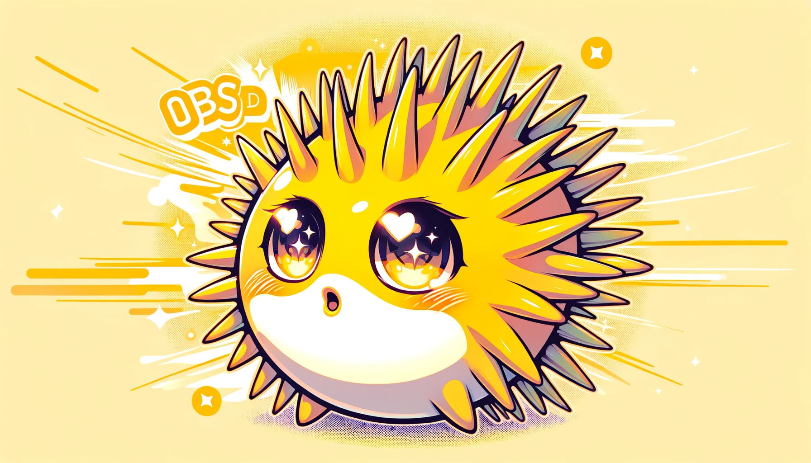
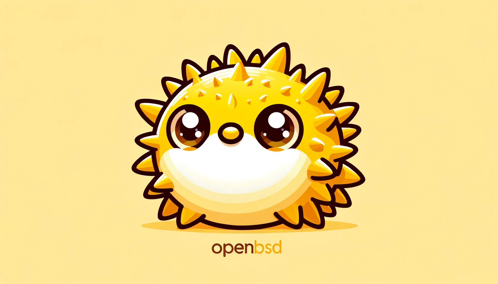


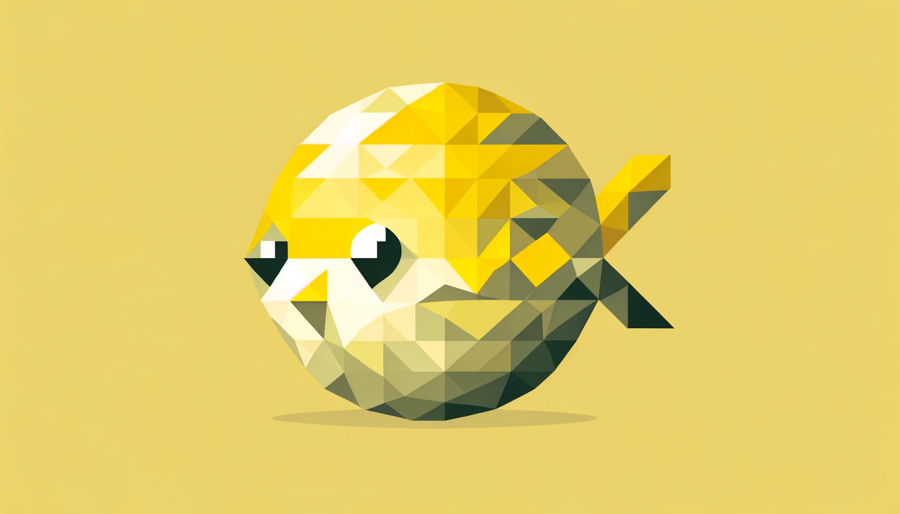


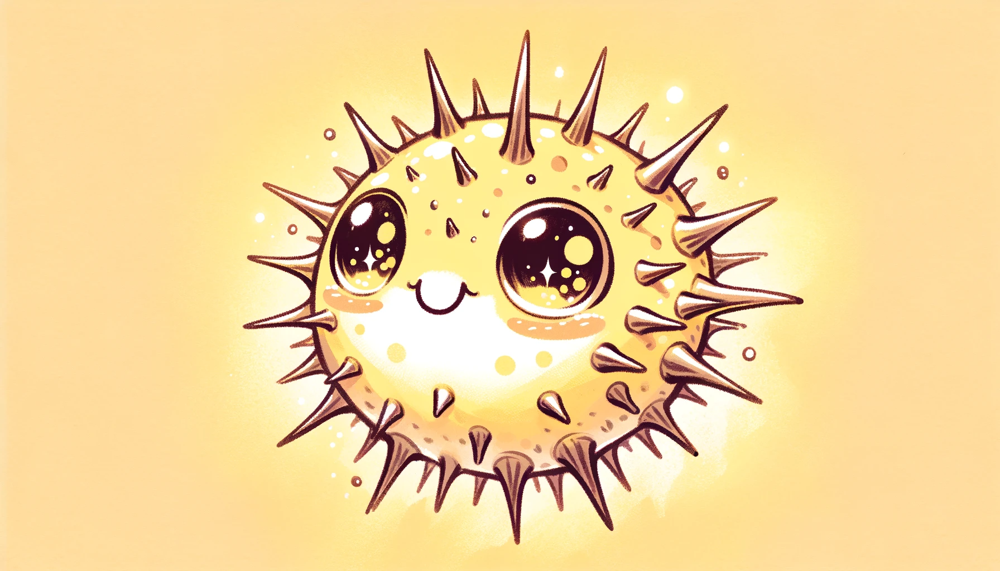


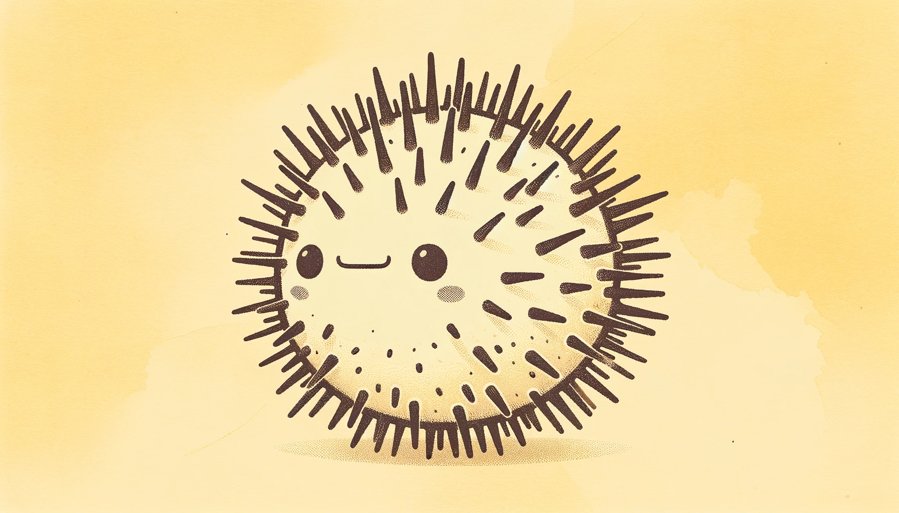


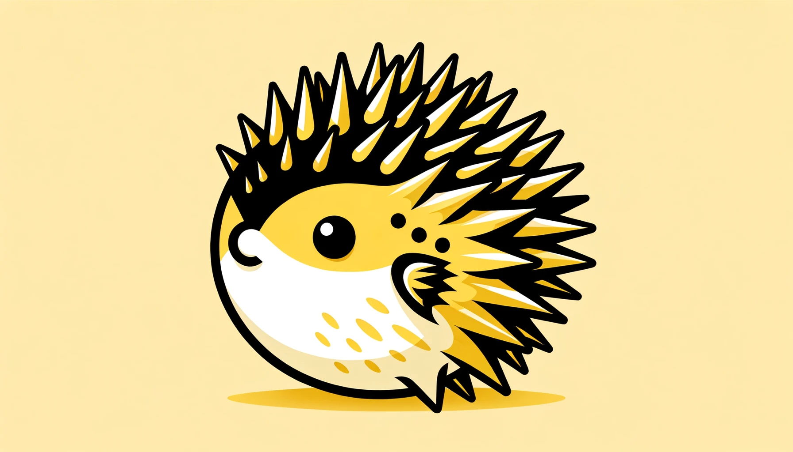


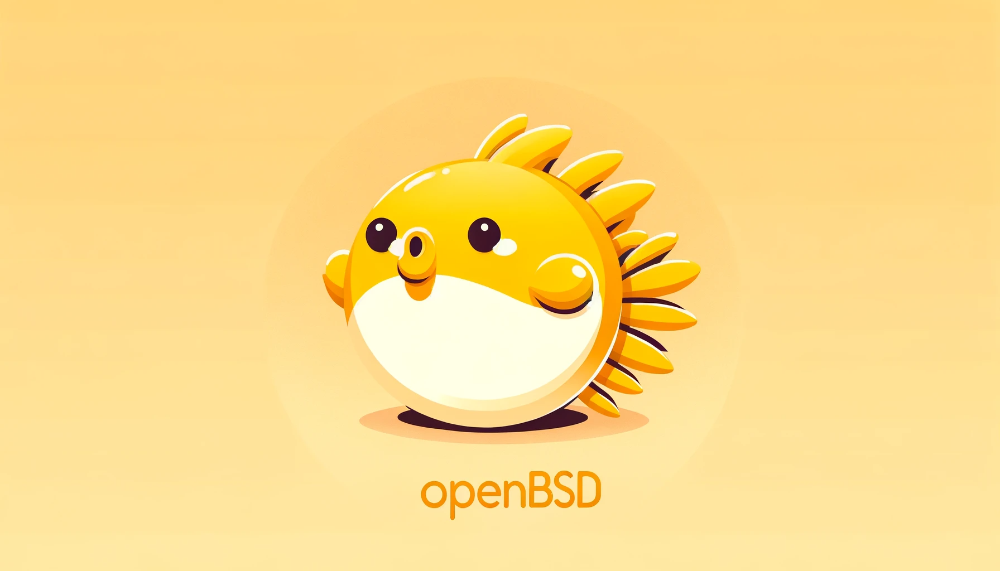
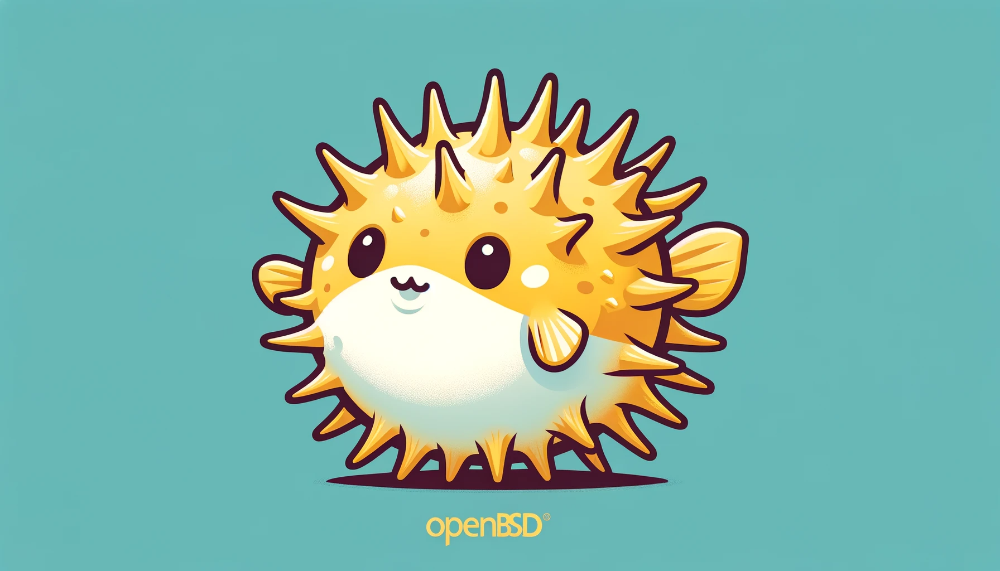


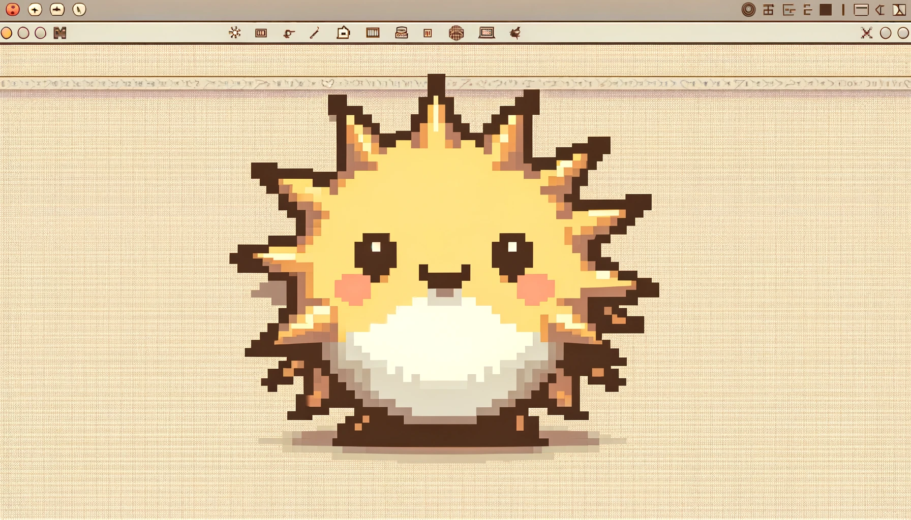
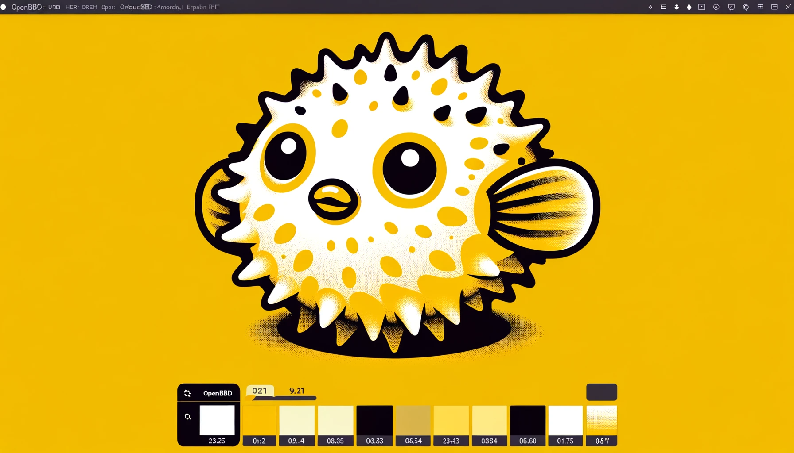

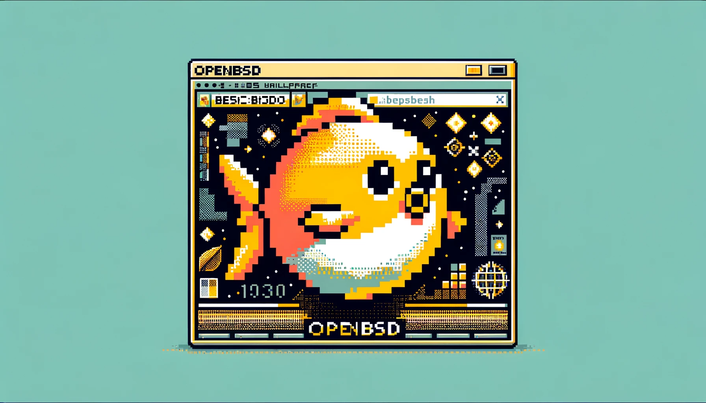


## Usage

To use these wallpapers on your OpenBSD system, simply download the ones you like and set them as your desktop background. Enjoy a fresh and stylish look for your OpenBSD desktop!

### Option 1: Download as a zip archive

1. Click on the "Code" button at the top of the repository page.
2. Select "Download ZIP" from the dropdown menu.
3. Save the ZIP archive to your preferred directory on your OpenBSD system.

### Option 2: Clone the repository with git

1. Open your terminal.
2. Navigate to the directory where you want to store the wallpapers.
3. Run the following command to clone the repository:

   ```shell
   git clone https://github.com/raffaelschneider/awesome-openbsd-desktop
   ```

## Setting Wallpapers with `feh` in Xorg

[`feh`](https://feh.finalrewind.org/) is a lightweight and versatile image viewer that can also be used to set wallpapers in Xorg. Follow these steps to set one of the downloaded wallpapers as your desktop background:

1. Open your terminal.

2. Navigate to the directory where you downloaded or cloned the wallpapers.

3. Run the following command to set a wallpaper using `feh`:

   ```shell
   feh --bg-scale your-wallpaper.png
   ```

   Replace `your-wallpaper.png` with the filename of the wallpaper you want to set as your background.

   For example, if you want to set "openBSD_wall_dalle3_asdv.png" as your background, you would run:

   ```shell
   feh --bg-scale openBSD_wall_dalle3_asdv.png
   ```

   This command will scale the wallpaper to fit your screen.

4. Your selected wallpaper should now be set as your desktop background in Xorg.

Note: You can further customize the appearance of your wallpaper using additional `feh` options. Refer to the `feh` documentation for more advanced configuration options if needed.

That's it! You've successfully downloaded the wallpapers from the repository and set one of them as your background using `feh` in your Xorg environment. Enjoy your new OpenBSD desktop wallpaper!

## Awesome

➡️ If you want more of OpenBSD, I'm also hosting a [Awesome OpenBSD Desktop](https://github.com/raffaelschneider/awesome-openbsd-desktop) list here in Github.

## License

This repository is open-source, and the wallpapers are provided under the terms of the [LICENSE](LICENSE) file. Please review the license for usage details.

If you have any questions, suggestions, or would like to contribute your own OpenBSD wallpapers, feel free to reach out and get involved in our community.

Happy OpenBSD wallpapering!

